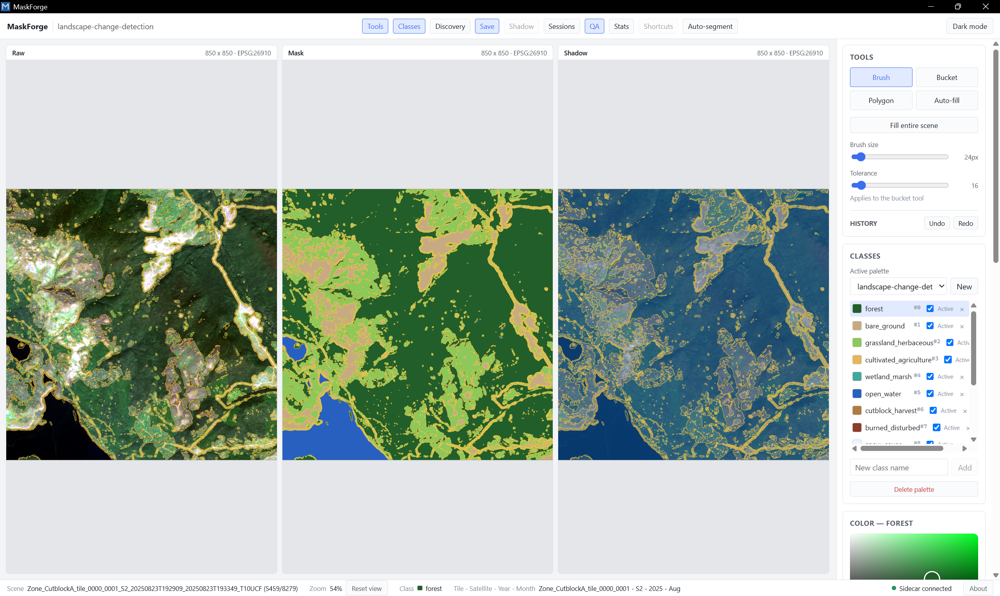

# MaskForge



A standalone desktop application for annotating and correcting raster segmentation masks on any imagery — satellite, aerial, or plain photographs, georeferenced or not.

MaskForge offers configurable scene discovery instead of a hardcoded folder convention, persisted and shareable class palettes instead of hardcoded classes, vectorized painting tools, arbitrary-factor resampling, and a single installer with no separate Python/runtime setup required.

## Features

- **Configurable scene discovery** — point at a source root and describe your folder/file naming with glob patterns; no fixed directory convention.
- **Zarr support** — read scenes directly out of per-tile `.zarr` stores (in addition to GeoTIFF/PNG), via a pluggable raster-format registry.
- **Multi-panel synchronized editor** — view raw imagery, a shadow/contrast layer, and the mask side by side (1–4 panels), pan/zoom locked together.
- **Class palettes** — define classes with names, colors, and values; save palettes for reuse; activate a subset per session.
- **Painting tools** — brush, bucket fill, polygon, and an image-guided auto-fill, all vectorized for large images.
- **Color picker with safe remapping** — pick colors in HSV/RGB/HEX; remapping an already-used color previews the affected pixel count before applying.
- **Border contours** — thin, non-dilated class boundaries rendered live, cached incrementally.
- **Flexible export** — GeoTIFF (RGBA/RGB) or PNG, custom output folder structure, optional resampling (native, or arbitrary target resolution with nearest or majority/"mode" categorical downsampling).
- **Shadow/contrast generation** — when a shadow layer is missing, generate one from the raw image using a percentile/arcsinh/gamma pipeline, CLAHE, HSV-based shadow indexing, or DEM hillshade — never overwrites a manually supplied file.
- **Session persistence & autosave** — full session state (discovery config, active palette, save settings, UI state) persisted locally, with periodic autosave and crash recovery.
- **QA workflow** — per-scene status (todo / in progress / validated / flagged), filterable, with batch navigation.
- **Review mode** — before/after diff overlay for correcting existing masks.
- **Light/dark theme, customizable keybindings, exportable per-class statistics.**

## Installation

Download the installer from the [latest release](https://github.com/Research-Tarka/maskforge/releases/latest) and run it — no other software required (Windows 10/11).

## Running it

Requirements: Node.js 20+, Rust (stable), Python 3.12.

**Windows:** double-click [MaskForge.bat](MaskForge.bat) — it installs dependencies on first run (frontend `npm install`, sidecar virtualenv) and then launches the app. Subsequent runs skip straight to launch.

Or manually:

```
# install frontend deps
npm install

# install sidecar deps (from sidecar/)
cd sidecar && python -m venv .venv && .venv/Scripts/pip install -e ".[dev]"

# run the full app in dev mode (spawns the sidecar automatically)
npm run tauri dev
```

Run tests:

```
# sidecar
cd sidecar && .venv/Scripts/python -m pytest tests/ -v

# frontend
npm run build   # tsc --noEmit + vite build
```

## Support

If MaskForge is useful to you, consider [sponsoring on GitHub](https://github.com/sponsors/Research-Tarka) — no obligation, just a way to support continued development.

## License

Copyright (C) 2026 Maxime Tarka

This program is free software: you can redistribute it and/or modify
it under the terms of the GNU Affero General Public License as published by
the Free Software Foundation, either version 3 of the License, or
(at your option) any later version.

This program is distributed in the hope that it will be useful,
but WITHOUT ANY WARRANTY; without even the implied warranty of
MERCHANTABILITY or FITNESS FOR A PARTICULAR PURPOSE. See the
[LICENSE](LICENSE) file (GNU AGPL v3) for details.
